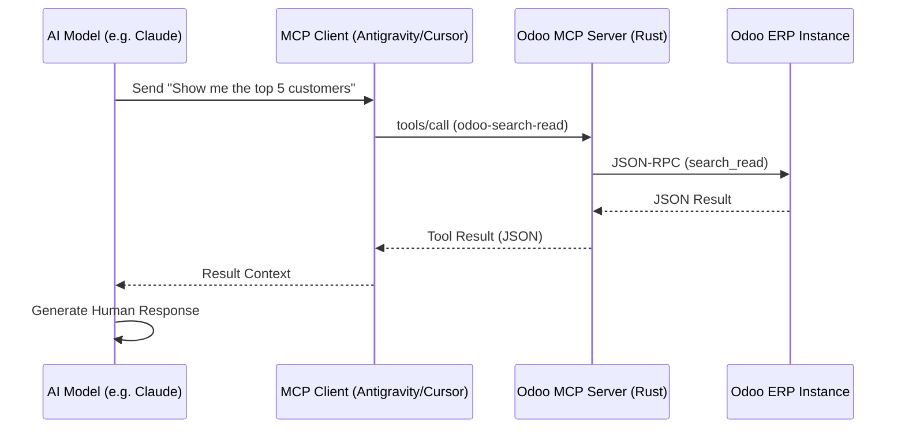

# Odoo ERP MCP Server (Rust)

A high-performance, secure Model Context Protocol (MCP) server built in Rust for seamless interaction with Odoo ERP systems. This server allows AI models (like Claude, GPT-4, etc.) to perform advanced ORM operations and data analysis on Odoo models natively.

## 🚀 Features

- **Standard CRUD**: Search, Create, Update, and Delete any Odoo model.
- **Advanced Tools**: 
    - `search_count`: Get record counts matching specific criteria.
    - `read_group`: Perform aggregated analysis (group by, sums, counts).
    - `copy`: Quickly duplicate existing records.
    - `get_metadata`: Inspect model structures and field definitions.
- **Web Configuration UI**: Modern, dark/light mode interface at `http://localhost:3333` to manage multiple Odoo instances and custom AI prompts.
- **Protocol Version 2025-11-25**: Built on the latest stable MCP specification for reliability and rich metadata support.

## 🛠 Tech Stack

- **Rust**: Language of choice for performance and safety.
- **Tokio**: Asynchronous runtime for non-blocking I/O.
- **Axum**: Lightweight web framework for the configuration UI.
- **Reqwest**: For handling Odoo JSON-RPC communication.
- **Serde**: For high-speed JSON serialization.

## 📦 Getting Started

### Prerequisites

- [Rust & Cargo](https://rustup.rs/) (Stable)
- An Odoo Instance (v12 to v17 supported)

### Local Development

1. **Clone the repository**:
   ```bash
   git clone <repo-url>
   cd odoo-erp-mcp
   ```

2. **Run the server**:
   ```bash
   cargo run
   ```

3. **Configure via UI**:
   Open `http://localhost:3333` in your browser to add your Odoo instance credentials. These are saved securely in `config.json`.

### MCP Communication Flow



## 🚢 Deployment & Release

### Build for Release
To generate a highly optimized binary:
```bash
cargo build --release
```
The binary will be located at `./target/release/odoo-erp-mcp`.

### Deploying to Production
1. Copy the compiled binary and the `src/index.html` (if not embedded) to your server.
2. Ensure `config.json` is present or initialized via the UI on first run.
3. Add the binary path to your MCP client configuration (e.g. `claude_desktop_config.json`).

## 📄 License
This project is licensed under the GNU AGPL-3.
