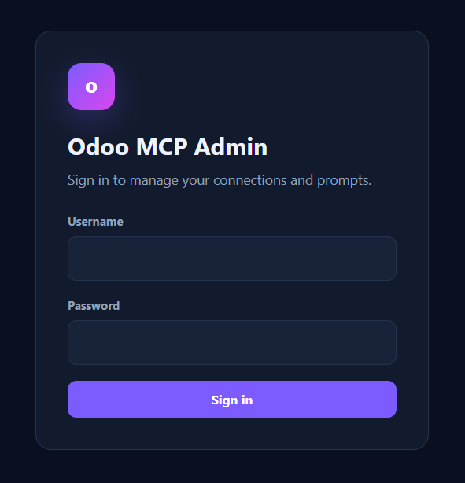
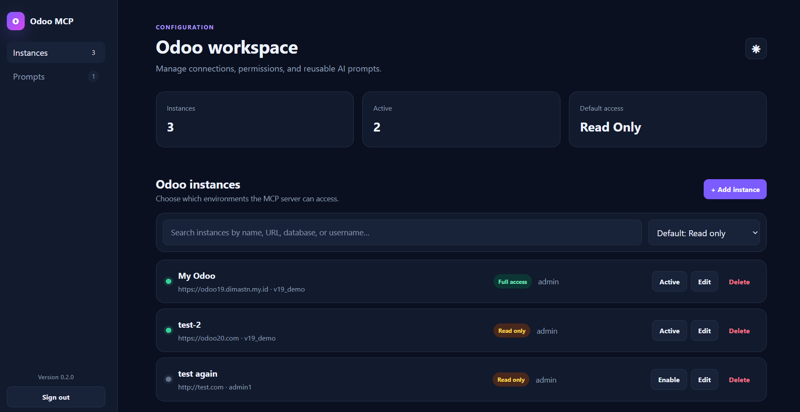
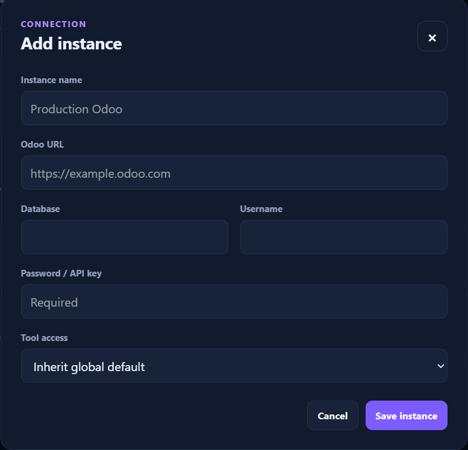
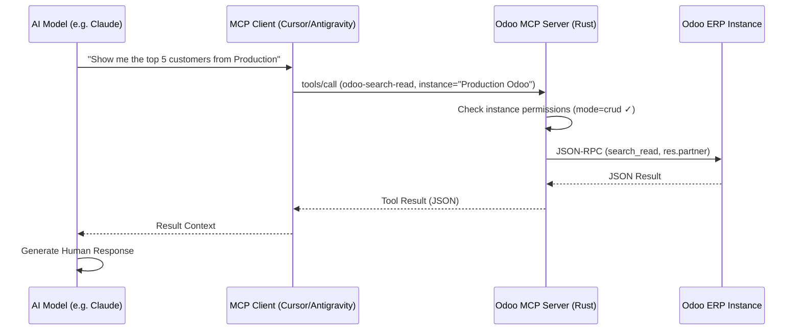

# Odoo ERP MCP Server (Rust)

A high-performance, secure Model Context Protocol (MCP) server built in Rust for seamless interaction with Odoo ERP systems. This server allows AI models (like Claude, GPT-4, etc.) to perform advanced ORM operations and data analysis on Odoo models natively.

[](https://github.com/dimastriann/odoo-erp-mcp/releases)
[](LICENSE)
[](#-download)

## 🚀 Features

- **Standard CRUD**: Search, Create, Update, and Delete any Odoo model.
- **Advanced Tools**:
    - `odoo-search-read`: Search and retrieve records with field selection.
    - `odoo-search`: Search and return only record IDs.
    - `odoo-read`: Read specific records by ID.
    - `odoo-search-count`: Get record counts matching specific criteria.
    - `odoo-read-group`: Perform aggregated analysis (group by, sums, counts).
    - `odoo-copy`: Quickly duplicate existing records.
    - `odoo-get-metadata`: Inspect model structures and field definitions.
- **Multi-Instance Support**: Configure and keep **multiple Odoo instances active simultaneously**. Each tool call can target a specific instance by ID or name, or fall back to the default active one.
- **Global & Per-Instance Tool Permissions**:
    - Set a **Global Default Mode** (`crud` or `read_only`) that applies to all instances by default.
    - **Override per instance**: each instance can be set to `crud`, `read_only`, or `inherit` (from global).
    - Or use a **custom `allowed_tools` list** for fine-grained control.
- **Web Configuration UI**: Modern dark/light mode interface at `http://localhost:3333` to manage instances, permissions, and AI prompts — no config file editing needed.
- **Protocol Version 2025-11-25**: Built on the latest stable MCP specification.

## 📸 Screenshots

### Secure Admin Login

The configuration dashboard is protected by the administrator credentials supplied through `ODOO_MCP_UI_USERNAME` and `ODOO_MCP_UI_PASSWORD`.



### Configuration Dashboard

The responsive workspace summarizes total and active instances, shows the server version, supports instance search, and provides global and per-instance access controls. Connection secrets are never returned to the browser after they are saved.



### Add or Edit an Odoo Instance

Configure the instance URL, database, Odoo username, password or API key, and tool-access mode. Existing secrets can be retained during editing by leaving the password field blank.



## 🛠 Tech Stack

- **Rust**: Language of choice for performance and safety.
- **Tokio**: Asynchronous runtime for non-blocking I/O.
- **Axum**: Lightweight web framework for the configuration UI.
- **Reqwest**: For handling Odoo JSON-RPC communication.
- **Serde**: For high-speed JSON serialization.

## 📦 Getting Started

### Prerequisites

- [Rust & Cargo](https://rustup.rs/) (Stable)
- An Odoo Instance (v12 to v19+ supported)

### Local Development

1. **Clone the repository**:
   ```bash
   git clone <repo-url>
   cd odoo-erp-mcp
   ```

2. **Copy the example config**:
   ```bash
   cp config.example.json config.json
   ```

3. **Run the server**:
   ```bash
   # Set persistent Web UI administrator credentials first
   export ODOO_MCP_UI_USERNAME=admin
   export ODOO_MCP_UI_PASSWORD='replace-with-a-strong-password'
   cargo run
   ```

   PowerShell equivalent:
   ```powershell
   $env:ODOO_MCP_UI_USERNAME = "admin"
   $env:ODOO_MCP_UI_PASSWORD = "replace-with-a-strong-password"
   cargo run
   ```

4. **Configure via UI**:
   Open `http://localhost:3333`, sign in, and add your Odoo instance credentials. Changes are saved automatically to `config.json`. If `ODOO_MCP_UI_PASSWORD` is omitted, the server generates a temporary password and prints it to stderr at startup.

The Web UI listens on `127.0.0.1:3333` by default. Set `ODOO_MCP_UI_BIND` (for example, `0.0.0.0:3333`) only when remote access is intentional, and place it behind HTTPS because its session cookie is designed for the local HTTP default.

### Configuration

The server stores its configuration in `config.json` (excluded from git). Use `config.example.json` as a starting template.

```json
{
  "global_settings": {
    "default_mode": "crud"
  },
  "instances": [
    {
      "id": "1",
      "name": "Production Odoo",
      "url": "https://your-odoo-instance.example.com",
      "db": "your_database",
      "username": "admin",
      "password": "your_password_or_api_key",
      "active": true,
      "mode": "crud",
      "allowed_tools": null
    },
    {
      "id": "2",
      "name": "Staging Odoo",
      "url": "https://staging.example.com",
      "db": "staging_db",
      "username": "admin",
      "password": "your_password_or_api_key",
      "active": true,
      "mode": "read_only",
      "allowed_tools": null
    }
  ],
  "prompts": []
}
```

**`mode` options per instance:**

| Value | Behaviour |
|-------|-----------|
| `inherit` | Use the global default mode |
| `crud` | Full read & write access |
| `read_only` | Search, read, and aggregate only — create/update/delete/copy are blocked |

### MCP Communication Flow



## 🔌 Editor Integration

You can integrate this MCP server with various AI-powered code editors. Ensure you have compiled the server or downloaded the executable.

> **Note on Paths**: On Windows, point to the `.exe` file (e.g. `C:\\path\\to\\odoo-erp-mcp.exe`). On Linux/macOS, point to the binary directly (e.g. `/path/to/odoo-erp-mcp`).

### Cursor
1. Go to **Cursor Settings** > **Features** > **MCP Servers**.
2. Click **+ Add new MCP server**.
3. Set the **Name** to `odoo-mcp`.
4. Set the **Type** to `command`.
5. Set the **Command** to the absolute path of your `odoo-erp-mcp` executable.

### Antigravity / Claude Desktop
Add the server to your `mcp_config.json`:

```json
{
  "mcpServers": {
    "odoo-mcp": {
      "command": "absolute/path/to/odoo-erp-mcp",
      "args": [],
      "env": {}
    }
  }
}
```

### Visual Studio Code (Cline / Claude Dev)
Edit your MCP settings file (e.g. `cline_mcp_settings.json`):

```json
{
  "mcpServers": {
    "odoo-mcp": {
      "command": "absolute/path/to/odoo-erp-mcp",
      "args": [],
      "env": {}
    }
  }
}
```

### PyCharm / JetBrains IDEs
1. Open the plugin's MCP server configuration.
2. Add a new **Stdio** based server.
3. Configure the command path to the `odoo-erp-mcp` executable.

## 🚢 Deployment & Release

### Build for Release
```bash
cargo build --release
```
The binary will be located at `./target/release/odoo-erp-mcp`.

### Deploying to Production
1. Copy the compiled binary to your server.
2. Copy `config.example.json` as `config.json` and fill in your credentials, or configure via the Web UI on first run.
3. Add the binary path to your MCP client configuration.

### GitHub Actions Release
The included workflow (`.github/workflows/release.yml`) automatically:
- Builds optimized binaries for **Linux**, **Windows**, and **macOS** on every version tag push.
- Names each artifact with the version number (e.g. `odoo-erp-mcp-windows-0.3.0.exe`).
- Publishes a GitHub Release with all three binaries attached.

To release a new version:
```bash
git tag v0.3.0
git push origin main --tags
```

## 📄 License
This project is licensed under the MIT License.
